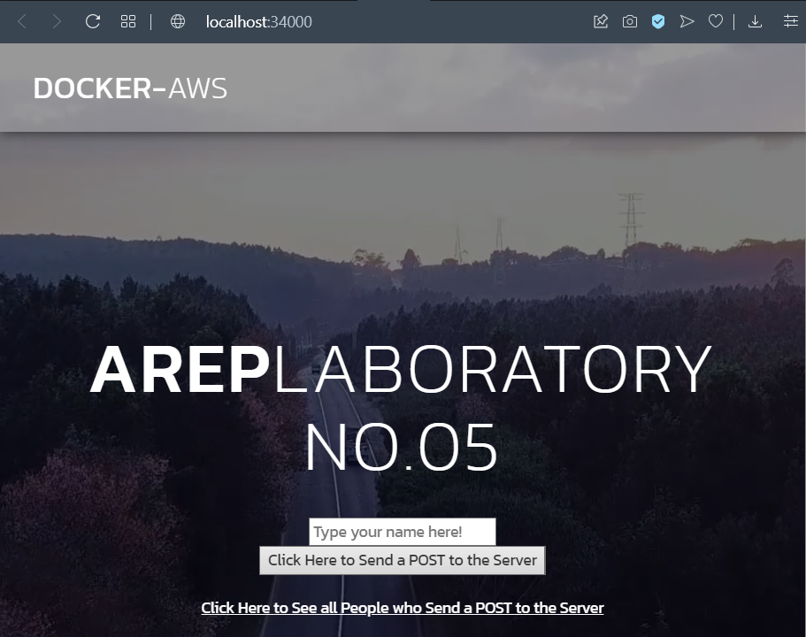

# Taller 05 
### Juan Sebastian Garcia Hincapie 

## AWS

- El servicio MongoDB es una instancia de MongoDB corriendo en un container de docker en una máquina virtual de EC2
- LogService es un servicio REST que recibe una cadena, la almacena en la base de datos y responde en un objeto JSON con las 10 ultimas cadenas almacenadas en la base de datos y la fecha en que fueron almacenadas.
- La aplicación web APP-LB-RoundRobin está compuesta por un cliente web y al menos un servicio REST. El cliente web tiene un campo y un botón y cada vez que el usuario envía un mensaje, este se lo envía al servicio REST y actualiza la pantalla con la información que este le regresa en formato JSON. El servicio REST recibe la cadena e implementa un algoritmo de balanceo de cargas de Round Robin, delegando el procesamiento del mensaje y el retorno de la respuesta a cada una de las tres instancias del servicio LogService.

###Funcionamiento: 

Pagina principal en local 

despliegue de paginas por 3 puertos distintos

base de datos

## Construido con

* [Java] (https://www.oracle.com/technetwork/java/javase/downloads/jdk8-downloads-2133151.html)
* [Maven] (https://maven.apache.org/)
* [Docker] (https://www.docker.com)
* [AWS] (https://aws.amazon.com/es/)

## Licencia

Este proyecto está licenciado bajo la Licencia MIT - vea el archivo [LICENSE.md] (LICENSE.md) para más detalles
